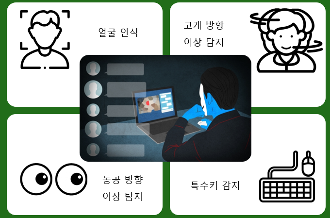
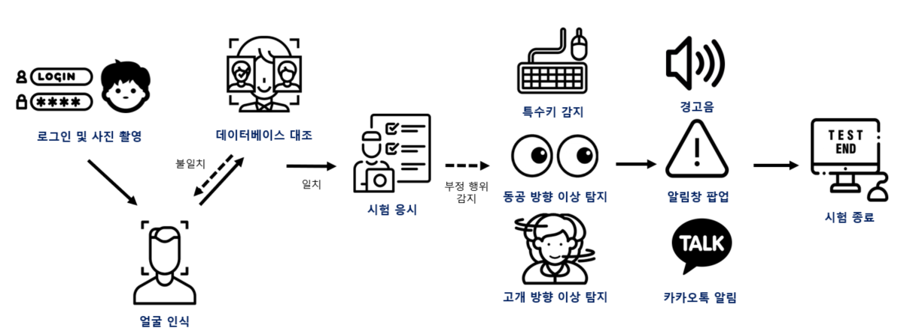

# 📊 딥러닝 기반 비대면 시험 부정행위 방지 시스템 

 
             

 

## 👀 프로젝트 개요

-  📆 프로젝트 기간
   -  2022.09.01 ~ 2023.06.01

-  📌 기획 배경
   -  교내 원격수업 및 교류대학 원격수업 과정에서 부정행위 속출
   -  “*** 대학 이러닝 지원센터 (****)” 에서도 *** 대학 중 **대학교만 유일하게 대면으로 시험 실시 
   - 위 문제점을 해결하고자 주제 선정
  
-  👓 메인 타겟
   -  비대면 시험을 주최하는 관리자

-  💍 핵심 가치

   -  **공정성과 신뢰성 향상**
      -  비대면 시험의 부정행위 문제를 해결하여 시험의 공정성과 신뢰성을 향상 ➡️ 딥러닝 기술을 활용한 부정행위 패턴 감지 및 대응 시스템 도입
   -  **응시자 간 불평등 해소**
      -  부정행위로 인한 응시자 간 불평등 문제 해결 ➡️ 공정하고 신뢰할 수 있는 평가 시스템을 통해 모든 응시자에게 평등한 기회 제공

  

## 💁‍♂️ 프로젝트 소개

 

**딥러닝 기반 비대면 시험 부정행위 방지 시스템** 의 목적은 비대면 시험의 공정성 문제를 딥러닝을 활용하여 해결하고 학생들 간의 불평등을 개선하는 것입니다. 딥러닝을 활용한 부정행위 방지 시스템을 개발하여 학생들에게 공정한 시험 환경을 제공하고, 시험 결과의 신뢰도를 확보하는 
것을 목표로 합니다.
 

딥러닝은 이미지와 영상 데이터를 처리하고 패턴을 학습하는 데에 강점을 지니고 있습니다. 따라서, 시험 중 부정행위를 탐지하는 데에 유용하게 활용될 수 있습니다. 본 졸업작품은 본인인증과 시선과 고개 방향의 이상 탐지를 딥러닝을 활용하여 구현하였습니다. 이를 통해 시험 중 부정행위를 신속하게 탐지하고 예방할 수 있습니다. 
 

작품의 특징점은 LSTM을 활용하여 응시자의 시선이 화면 밖에 특정 시간 이상 머무르게 되었을 때를 이상행동으로 분류하였다는 점입니다. 이상행동이라고 분류되기 위해서는 사용자가 시험지 기준에서 벗어나더라도 특정 시간 이상 지정 기준치에서 벗어나야 합니다. 이를 통해 억울한 상황을 최소화하고 공정한 환경에서 시험을 응시할 수 있도록 합니다.
 

이렇게 구현된 ‘딥러닝 기반 부정행위 방지 시스템’으로 비대면 시험의 부정행위로 인한 불평등을 최소화하여, 공정한 환경에서 시험을 응시할 수 있고, 시험 결과의 신뢰도를 확보할 수 있도록 하는 것을 목표로 하고 있습니다.

 

## 💡 주요 기능

### 1️⃣ 사용자 본인인증 기능

> 서비스 내용 
> - 입력된 로그인 정보와 웹캠에서 캡쳐한 이미지를 통해 본인인증 과정을 수행하였습니다.

> 사용 기술
> - 얼굴 검출 및 정렬 : 눈의 위치 좌표를 MTCNN 알고리즘을 사용해서 검출하고, 검출된 눈의 좌표를 유클리드 계산하여 코사인 법칙을 통해 얼굴이 정면을 바라 볼 수 있도록 회전하였습니다.
> - 얼굴 인식 과정: 입력된 이미지와 데이터베이스 내에 있는 사진들을 ‘VGG-Face’ 모델을 사용하여 사진에서 추출한 얼굴 특징들 사이의 유사도를 계산하여 입력된 이미지와 동일한 이미지를 찾아냈습니다.
 

### 2️⃣ 동공방향 이상탐지 기능

> 서비스 내용
> -  사용자의 얼굴 방향이 정면을 향하고 동공방향이 기준에서 벗어나는 경우를 탐지하는 기능을 수행합니다.

> 사용 기술 
> -	Mediapipe 활용 : 동공의 좌표, 눈머리와 눈꼬리의 좌표를 검출합니다.
> -	유클리드 거리 계산 : 동공의 중심에서 눈머리와 눈꼬리까지의 거리의 비율을 비교해 동공의 위치를 판별합니다. 동공의 중심과 눈의 양 끝 좌표의 비율이 10% 이내의 차이를 가진다면 정면을 바라보는 것으로 판별하였고, 30% 이상의 차이를 가진다면 좌, 우를 바라본다고 판별하였습니다. 
> -	MLP 모델을 사용하여 얼굴 방향이 정면을 바라보고 있고, 검출한 동공 방향이 오른쪽이나 왼쪽일 경우 동공 이상행동으로 탐지하도록 설계했습니다.

 

### 3️⃣ 고개방향 이상탐지 기능

> 서비스 내용
> - 응시자의 고개 방향이 기준치에서 5초 이상 벗어난 경우를 탐지하고 방향 정보도 함께 예측하는 기능을 수행합니다.

> 사용 기술 
> -	LSTM 모델 : 응시자의 고개 방향이 정면에서 5초 이상 벗어난 경우를 이상행동으로 분류하여 탐지합니다.
> -	normal : 정면을 바라보거나 5초 이하로 다른 곳을 응시할 때는 normal로 분류합니다.
> -	abnormal : 기준에서 벗어나 5초 이상 응시할 경우 abnormal로 분류합니다. abnormal 분류와 함께 MLP 모델을 불러와 고개 방향을 예측합니다.

 

## 🗂 서비스 아키텍쳐 
- 👨‍🎨 **Development**
  - Language
    -  
  - Framework / Library
    -      
  - Data
    - 
  - open API
    - 

- 👨‍👩‍👦 **Common**
  - Co-work
    -   

---
